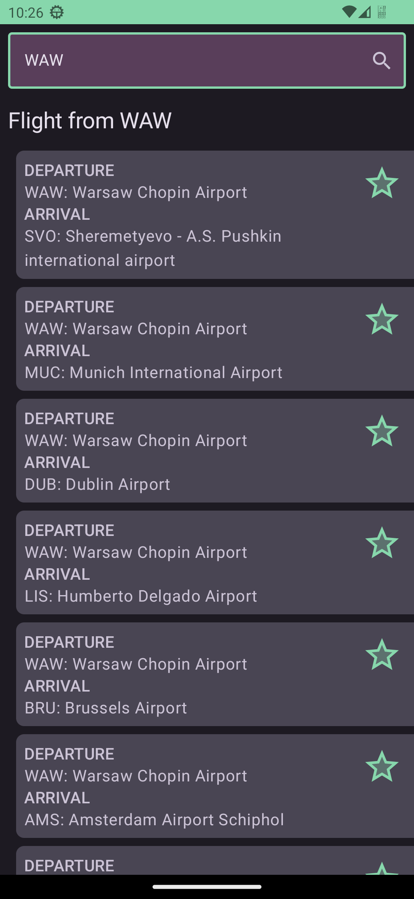
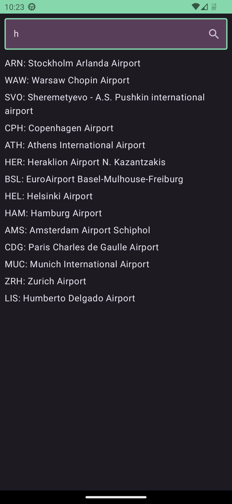
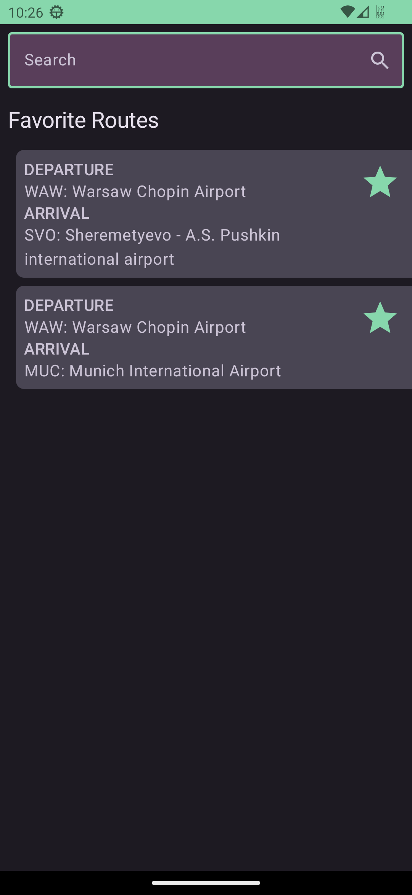

# Flight Search Android App

The Flight Search Android App is designed to make your travel planning easier and more convenient. This app allows you to search for flights, autocomplete airport names, and mark your favorite flights for quick access.
*Note: This a demo app*

## Features

- **Flight Search:** Search for flights based on your preferred departure and destination airports.
- **Autocomplete Airport:** Enjoy the convenience of autocomplete functionality when entering airport names, making the search process faster and more accurate.
- **Favorite Flights:** Mark flights as favorites to save them for future reference or quick access.

## Screenshots

## Installation

1. Download the APK file from the [releases](https://github.com/Indresh10/FlightSearch/releases) section of this repository.
2. Transfer the APK file to your Android device.
3. On your Android device, navigate to **Settings > Security** and enable **Unknown sources** to allow the installation of apps from sources other than the Play Store.
4. Use a file manager app to locate the APK file and tap on it to begin the installation.
5. Follow the on-screen instructions to install the Flight Search app on your device.
6. Once installed, you can find the app icon on your home screen or app drawer.

## Usage

1. Launch the Flight Search app by tapping on its icon.
2. On the main screen, search for departure airport.
3. As you type, the app will autocomplete the airport names, making it easier to select the correct options.
4. Tap the airport to retrieve flight options based on your inputs.
5. Browse through the available flights.
6. To mark a flight as a favorite, tap the star icon associated with the flight.
7. Access your favorite flights on the home screen.

## Contributing

Contributions to the Flight Search app are welcome! If you find any issues, have suggestions, or would like to add new features, please feel free to submit a pull request.

## License

This project is licensed under the [MIT License](LICENSE).

## Acknowledgments

We would like to acknowledge [Google Developer Training](https://github.com/google-developer-training) for providing the airport data used in this app. You can find more information about the data in this [repository](https://github.com/google-developer-training/android-basics-kotlin-sql-basics-app/tree/project).
